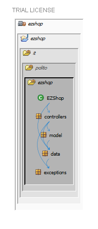
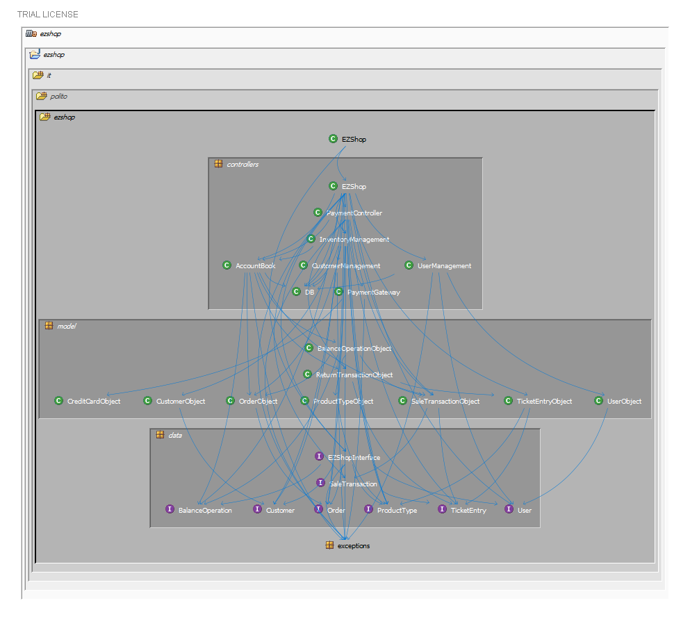
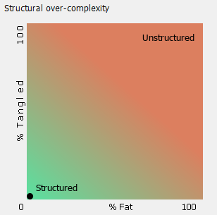
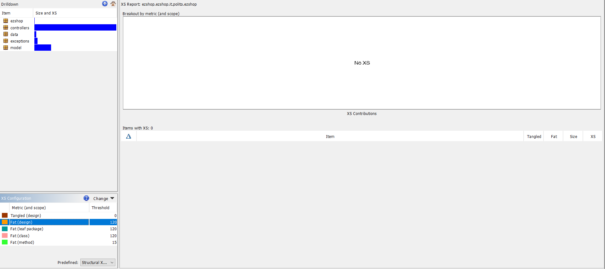

# Design assessment

# Levelized structure map

# Structural over complexity chart

# Size metrics

| Metric                                    | Measure |
| ----------------------------------------- | ------- |
| Packages                                  | 7       |
| Classes (outer)                           | 45      |
| Classes (all)                             | 45      |
| NI (number of bytecode instructions)      | 6,691   |
| LOC (non comment non blank lines of code) | 2,877   |

# Items with XS

| Item | Tangled | Fat  | Size | XS   |
| ---- | ------- | ---- | ---- | ---- |
|   -   | -        | -     | -     | -     |

No tangle or fat items had been found in the project

# Package level tangles

# Summary analysis

In the design we delivered on April 30, there were a lot of backward dependencies that caused many tangles (97% tangles due to the fact that the interfaces were implemented in the model package and those classes were called by classes belonging to data package).
To solve this we created a new package called controllers and we have reached a tangle of 0%.
