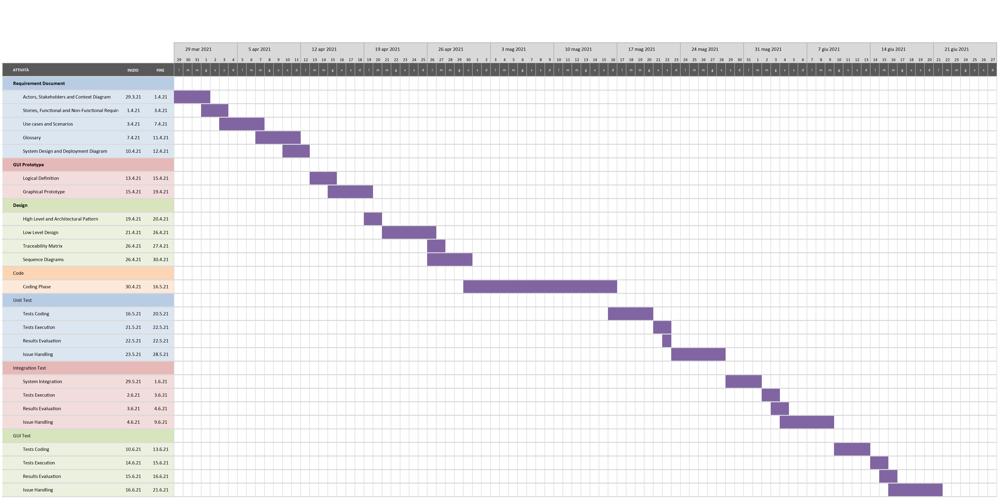

# Project Estimation  

Authors: Andrea Cavallo, Giulio Carota, Angelo Oscar Piccirillo, Matteo Biffoni

Date: April 28, 2021

Version: 1.0

# Contents
- [Estimate by product decomposition](#estimate-by-product-decomposition)
- [Estimate by activity decomposition ](#estimate-by-activity-decomposition)
# Estimation approach
# Estimate by product decomposition
### 
|             | Estimate                        |             
| ----------- | ------------------------------- |  
| NC =  Estimated number of classes to be developed   |               21             |             
|  A = Estimated average size per class, in LOC       |              190             | 
| S = Estimated size of project, in LOC (= NC * A)    |              3990            |
| E = Estimated effort, in person hours (here use productivity 10 LOC per person hour)  |                 399                 |   
| C = Estimated cost, in euro (here use 1 person hour cost = 30 euro) |          11970              | 
| Estimated calendar time, in calendar weeks (Assume team of 4 people, 8 hours per day, 5 days per week ) |          2,5          |               
# Estimate by activity decomposition
### 
|         Activity name    | Estimated effort (person hours)   |             
| ----------- | ------------------------------- | 
| Requirement Document | 80  | 
| GUI prototype        | 40  |
| Design               | 44  |
| Code                 | 120 |
| Unit Test            | 52  |
| Integration Test     | 42  | 
| GUI test             | 36  |
###

