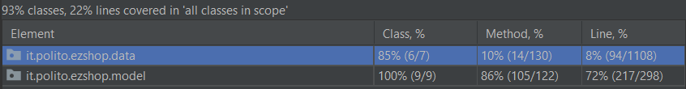
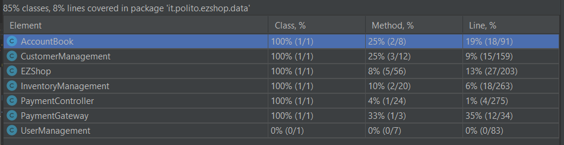
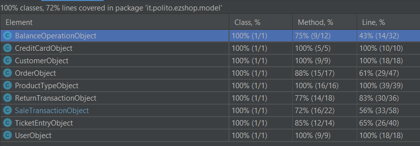

# Unit Testing Documentation

Authors: Biffoni Matteo, Carota Giulio, Cavallo Andrea, Piccirillo Angelo Oscar

Date: 19/05/2021

Version: 1.0

# Contents

- [Black Box Unit Tests](#black-box-unit-tests)


- [White Box Unit Tests](#white-box-unit-tests)


# Black Box Unit Tests


 ### **Class *PaymentGateway* - method *verifyCard***


**Criteria for method *verifyCard*:**
	

 - creditCard


**Predicates for method *verifyCard*:**

| Criteria | Predicate |
| -------- | --------- |
| length of creditCard  | [0, 15) |
|                       | [15,16] |
|                       | (16, 18] |
|                       | = 19     |
|                       | [20, maxint) |
| creditCard            | respect Luhn |
|                       | doesn't respect Luhn |


**Boundaries**:

| Criteria | Boundary values |
| -------- | --------------- |
| length of creditCard | 14, 15, 16, 17, 18, 19, 20 |
| creditCard           | 8996930288404152, 8996930288404151 |


**Combination of predicates**:


| length of creditCard | creditCard | Valid / Invalid | Description of the test case | JUnit test case |
|-------|-------|-------|-------|-------|
|[0, 15)|*|Invalid|T1(10, 1234567890) -> false| verifyLength |
|(16, 18]|*|Invalid|T2(17, 12345678912345678) -> false| verifyLength |
|[20, maxint)|*|Invalid|T3(20, 12345678912345678123) -> false| verifyLength |
|15|respect Luhn|Valid|T4(15, 347958709528955) -> true| verifyCombinations |
|16|respect Luhn|Valid|T4(16, 8996930288404152) -> true| verifyCombinations |
|19|respect Luhn|Valid|T5(19, 9873500591357334527) -> true| verifyCombinations |
|19|doesn't respect Luhn|Invalid|T6(19, 9873500594567123527) -> false| verifyValidity |
|16|doesn't respect Luhn|Invalid|T7(16, 8996930288123456) -> false| verifyValidity |
|15|doesn't respect Luhn|Invalid|T7(16, 899693028812345) -> false| verifyValidity |


 ### **Class *InventoryManagement* - method *isBarcodeValid***


**Criteria for method *isBarcodeValid*:**
	

 - length of barcode
 - barcode respects the Check Digit Validity Algorithm


**Predicates for method *isBarcodeValid*:**

| Criteria | Predicate |
| -------- | --------- |
| length of barcode  | [0, 12) |
|                       | [12,14] |
|                       | (14, maxint] |
| barcode            | respects Check Digit Validity Algorithm |
|                       | doesn't respect Check Digit Validity Algorithm |


**Boundaries**:

| Criteria | Boundary values |
| -------- | --------------- |
| length of barcode | 11, 12, 14, 15 |
| barcode           | - |


**Combination of predicates**:


| length of barcode | barcode | Valid / Invalid | Description of the test case | JUnit test case |
|-------|-------|-------|-------|-------|
|[0, 12)|*|Invalid|T1(6, 123456) -> InvalidProductIdException| isBarcodeValidTest |
|(14, maxint)|*|Invalid|T2(16, 1234568901234567) -> InvalidProductIdException| isBarcodeValidTest |
|[12, 14]|respects Check Digit Validity Algorithm|Valid|T3(13, 9788808182159) -> true| isBarcodeValidTest |
|[12, 14]|doesn't respect Check Digit Validity Algorithm|Invalid|T4(12, 123456789012) -> false| isBarcodeValidTest |


### **Class *SaleTransactionObject* - method *deleteEntry***


**Criteria for method *deleteEntry*:**
	

 - productCode


**Predicates for method *deleteEntry*:**

| Criteria | Predicate |
| -------- | --------- |
| productCode | present in a saleTransaction     |
|             | not present in a saleTransaction |


**Boundaries**:

| Criteria | Boundary values |
| -------- | --------------- |
| productCode |  |


**Combination of predicates**:


| productCode | Valid / Invalid | Description of the test case | JUnit test case |
|-------|-------|-------|-------|
|present in a saleTransaction|Valid|T1(9788808182159) -> true| testDeleteTicketEntry |
|not present in a saleTransaction|Invalid|T2(9788847057289) -> false| testDeleteTicketEntry |


 ### **Class *AccountBook* - method *computeNextId***


**Criteria for method *computeNextId*:**
	

 - Sale Transactions executed


**Predicates for method *computeNextId*:**

| Criteria                   | Predicate |
| -------------------------- | --------- |
| Sale Transactions executed | none      |
|                            | >= 1      |

**Boundaries**:

| Criteria                   | Boundary values |
| -------------------------- | --------------- |
| Sale Transactions executed | none, 1         |


**Combination of predicates**:


| Sale Transactions executed |Valid / Invalid | Description of the test case          | JUnit test case |
| -------------------------- | --------------- | ------------------------------------- | --------------- |
| 0                   |  Valid         | T1(0 sale transactions) -> nextId = 1           | testComputeNextId |
| 1                 |  Valid         | T2(1 sale transaction) -> nextId = 2    | testComputeNextId |


### **Class *AccountBook* - method *computeBalance***


**Criteria for method *computeBalance*:**


- Sale Transactions executed


**Predicates for method *computeBalance*:**

| Criteria                   | Predicate |
| -------------------------- | --------- |
| Sale Transactions executed | none      |
|                            | >= 1      |

**Boundaries**:

| Criteria                   | Boundary values |
| -------------------------- | --------------- |
| Sale Transactions executed | none, 1         |


**Combination of predicates**:


| Sale Transactions executed |Valid / Invalid | Description of the test case          | JUnit test case |
| -------------------------- | --------------- | ------------------------------------- | --------------- |
| 0                   |  Valid         | T1(0 sale transactions) -> balance = 0.0           | testComputeBalance |
| 1                 |  Valid         | T2(2 sale transactions (10.0 and 20.0)) -> balance = 30.0    | testComputeBalance |


### **Class *CustomerManagement* - method *generateCardCode***

### **Class *CustomerManagement* - method *cardExists***


**Criteria for method *cardExists*:**

- cardCode

**Predicates for method *cardExists*:**

| Criteria                   | Predicate |
| -------------------------- | --------- |
| cardCode | present in database      |
|  | not present in database      |

**Boundaries**:

| Criteria                   | Boundary values |
| -------------------------- | --------------- |
| cardCode | - |


**Combination of predicates**:


| cardCode |Valid / Invalid | Description of the test case          | JUnit test case |
| -------------------------- | --------------- | ------------------------------------- | --------------- |
| not present in database | valid | TC1("1234567891") -> false | cardExistsTest |
| present in database | valid | TC2() -> true | cardExistsTest |


### Getters and Setters

**Class *BalanceOperation***
|Method|Test Case|
|------|---------|
|getBalanceId| TC(12) -> 12 |
|getDate| TC(20/05/2021) -> 20/05/2021 |
|getMoney| TC(50) -> 50 |
|getType| TC("Sale Transaction") -> "Sale Transaction" |
|setBalanceId| TC(50) -> 50 |
|setDate| TC(25/05/2021) -> 25/05/2021 |
|setMoney| TC(100) -> 100 |
|setType| TC("Order Transaction") -> "Order Tramsaction" |

**Class *CreditCard***

|Method|Test Case|
|------|---------|
|getCode| TC("5555333322227777") -> "5555333322227777" |
|getBalance| TC(816629.02) -> 816629.02 |
|updateBalance| TC(balance - 221.05) -> 816407.97 |

**Class *Customer***
|Method|Test Case|
|------|---------|
|getCustomerName| TC("customerName") -> "customerName" |
|getCustomerCard| TC("1954123593") -> "1954123593" |
|getCustomerId| TC(123) -> 123 |
|getCustomerPoints| TC(20) -> 20 |
|setCustomerName| TC("newCustomerName") -> "newCustomerName" |
|setCustomerCard| TC("8396827512") -> "8396827512" |
|setCustomerId| TC(124) -> 124 |
|setCustomerPoints| TC(2) -> 2 |

**Class *ProductType***
|Method|Test Case|
|------|---------|
|getQuantity| TC(34) -> 34 |
|setQuantity| TC(20) -> 20 |
|getLocation| TC("1-a-1") -> "1-a-1" |
|setLocation| TC("1-a-1") -> "1-a-1" |
|getNote| TC("note") -> "note" |
|setNote| TC("newNote") -> "newNote" |
|getProductDescription| TC("test") -> "test" |
|setProductDescription| TC("newTest") -> "newTest" |
|getBarCode| TC("9788808182159") -> "9788808182159" |
|setBarCode| TC("9788832360103") -> "9788832360103" |
|getPricePerUnit| TC(1.0) -> 1.0 |
|setPricePerUnit| TC(36.78) -> 36.78 |
|getId| TC(1) -> 1 |
|setId| TC(5) -> 5 |

**Class *ReturnTransaction***
|Method|Test Case|
|------|---------|
|getReturnId| TC(0) -> 0 |
|getSaleTransactionId| TC(0) -> 0 |
|getMoney| TC(111.10) -> 111.10 |
|setMoney| TC(111.10) -> 111.10 |
|getSaleDiscountRate| TC(0.5)->0.5 |
|setSaleDiscountRate| TC(0.5)->0.5 |
|isOpen| TC("open")->"open" |
|isClosed| TC("closed")->"closed" |
|isPayed| TC("payed")->"payed" |
|updateMoney| TC(initial: 2.0, toAdd: 5.6) -> 2.0 + 5.6 |
|getDate| TC(LocalDate.now()) -> LocalDate.now() |

**Class *SaleTransaction***
|Method|Test Case|
|------|---------|
|getPrice| TC(100) -> 100 |
|setPrice| TC(100) -> 100 |
|getDiscountRate| TC(0.5)->0.5 |
|setDiscountRate| TC(0.5)->0.5 |
|isOpen| TC("open")->"open" |
|isClosed| TC("closed")->"closed" |
|isPayed| TC("payed")->"payed" |
|getDate| TC(LocalDate.now()) -> LocalDate.now() |


**Class *TicketEntry***
|Method|Test Case|
|------|---------|
|getBarcode| TC(9788808182159) -> 9788808182159 |
|setBarcode| TC(9788808182159) -> 9788808182159 |
|getProductDescription| TC("Apple Juice") -> "Apple Juice" |
|setProductDescription| TC("Orange Juice") -> "Orange Juice" |
|getAmount| TC(45) -> 45 |
|setAmount| TC(78) -> 78 |
|getPricePerUnit| TC(2.5) -> 2.5 |
|setPricePerUnit| TC(3.1) -> 3.1 |
|getDiscountRate| TC(0.25) -> 0.25 |
|setDiscountRate| TC(0.5) -> 0.5 |


**Class *User***
|Method|Test Case|
|------|---------|
|getId| TC(132) -> 132 |
|setId| TC(134) -> 134 |
|getUsername| TC("test_user") -> "test_user" |
|setUsername| TC("username2") -> "username2" |
|getPassword| TC("test_password") -> "test_password" |
|setPassword| TC("password2") -> "password2" |
|getRole| TC("test_role") -> "test_role" |
|setRole| TC("role2") -> "role2" |


# White Box Unit Tests

### Test cases definition


| Unit name | JUnit test case |
|--|--|
| AccountBook | AccountBookUnitTest | 
| BalanceOperationObject | BalanceOperationTest |
| CreditCardObject | CreditCardTest |
| CustomerManagement | CustomerManagementUnitTest |
| CustomerObject | CustomerTest |
| InventoryManagement | InventoryManagementUnitTest |
| PaymentGateway | PaymentGatewayTest |
| ProductTypeObject | ProductTypeTest |
| ReturnTransactionObject | ReturnTransactionUnitTest |
| SaleTransactionObject | SaleTransactionTest |
| TicketEntryObject | TicketEntryTest |
| UserObject | UserTest |


### Code coverage report

[comment]: <> (<Add here the screenshot report of the statement and branch coverage obtained using the Eclemma tool. >)
    




### Loop coverage analysis

```java
    1     int sum = 0;
    2     boolean alternate = false;
    3     if (creditCard.length()!=16 && creditCard.length()!=19)
    4          return false;
    5     for (int i = creditCard.length() - 1; i >= 0; i--)
    6     {
    7         int n = Integer.parseInt(creditCard.substring(i, i + 1));
    8         if (alternate)
    9         {
    10             n *= 2;
    11            if (n > 9)
    12            {
    13                n = (n % 10) + 1;
    14            }
    15        }
    16        sum += n;
    17        alternate = !alternate;
    18    }
    19    return (sum % 10 == 0);
```

|Unit name | Loop rows | Number of iterations | JUnit test case |
|---|---|---|---|
| PaymentGatewayTest | 5, 7, 8, 16, 17, 5, 7, 8, 10, 11, 13, 16, 17 ... x8 | 16 | T4(16, 8996930288404152) |
| PaymentGatewayTest | none | 0 | T1(10, 1234567890) |


